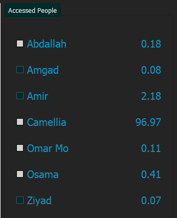
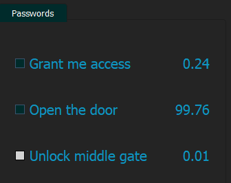
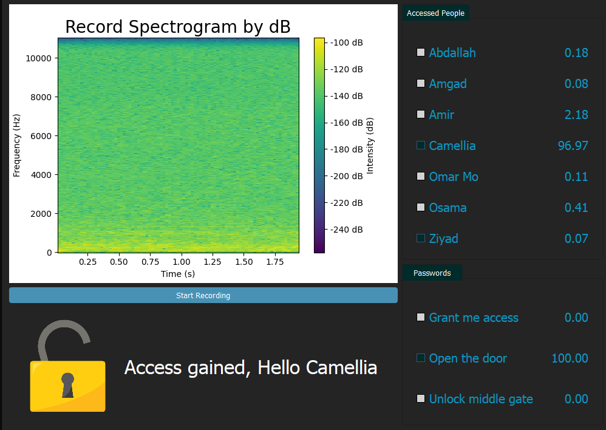

# SonicCipher

SonicCipher is an innovative project that leverages digital signal processing (DSP) and machine learning to create a unique and secure identification system. By combining voice fingerprinting and word fingerprinting, SonicCipher excels in speaker identification and word recognition.

## Features

### 1. **Voice Fingerprinting:**
   SonicCipher employs advanced DSP techniques, including Fourier transform, spectrograms, and Mel-frequency cepstral coefficients (MFCCs), to extract unique characteristics of a speaker's voice. This results in a personalized voice fingerprint for precise speaker identification.

   

### 2. **Word Fingerprinting:**
   In addition to speaker identification, SonicCipher utilizes DSP concepts to recognize specific words uttered by the speaker. This enhances the system's capability to verify not only who is speaking but also the content being spoken.

   

### 3. **Dual-layer Authentication:**
   SonicCipher goes beyond traditional systems by implementing a dual-layer authentication process. This involves validating both the speaker's identity through voice fingerprinting and confirming the spoken words through word fingerprinting, adding an extra layer of security.

   

### 4. **Machine Learning Model (SVC):**
   SonicCipher incorporates a Support Vector Classifier (SVC) from the SVM family for training a machine learning model. The model is trained on users' voice data and passwords, learning to distinguish between different speakers and recognize specific words.

### 5. **Real-time Processing:**
   SonicCipher is designed for real-time processing, enabling swift and seamless identification. The system efficiently processes incoming audio signals, making it suitable for applications such as access control, voice-activated commands, and secure communication.

### 6. **User-friendly Interface:**
   The project includes a user-friendly interface for easy integration and interaction. Developers can effortlessly incorporate SonicCipher into their applications, while end-users experience a smooth and intuitive authentication process.

Feel the power of SonicCipher as it transforms the way we approach speaker and word identification through cutting-edge DSP techniques and machine learning!

## Contributors

- [Ziyad ElFayoumy](https://github.com/Zoz-HF)
- [Amgad Atef](https://github.com/amg-eng)
- [Mahmoud Mohamed](https://github.com/Mahmoudm007)

